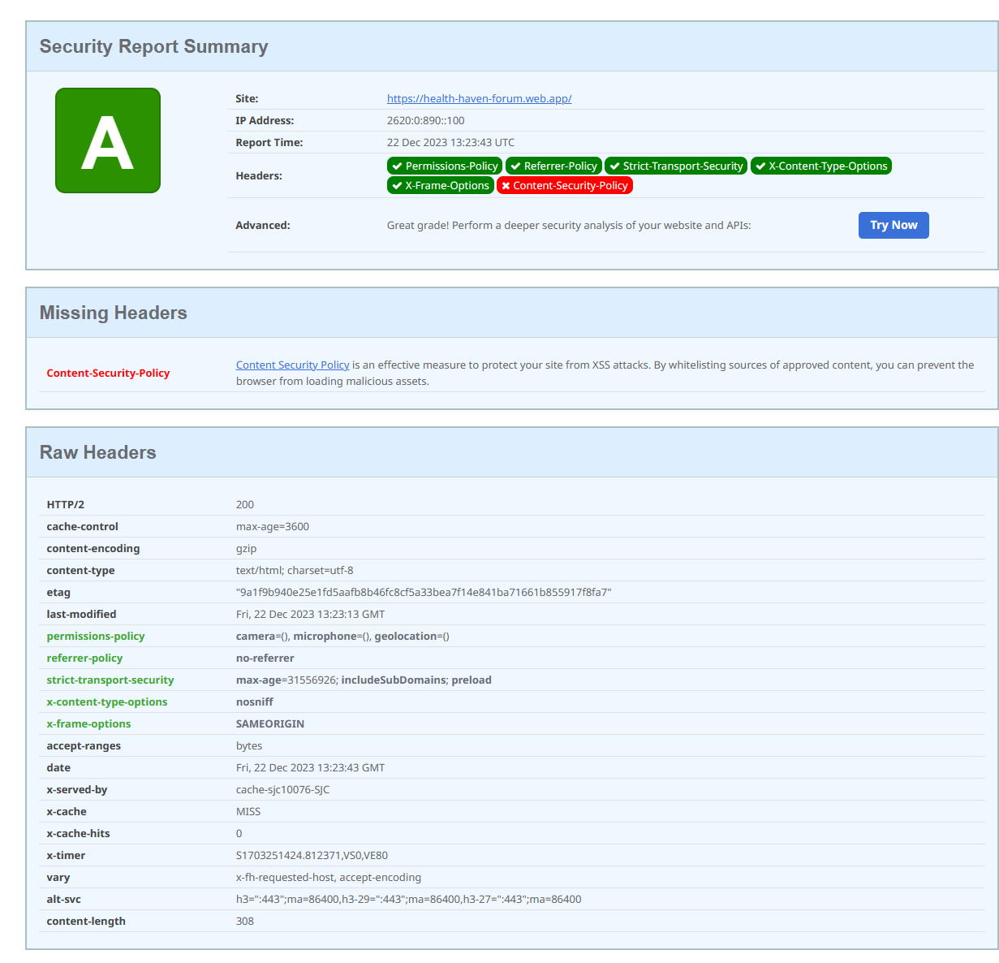

# GFP - MENTAL-Health-Forum-Application(Client)

### Technology Used:

    

 

## Brief Description

#### Project Theme
Good Health & Well Being

#### Project Purpose:
Anyone, either they are a teenager, young adult, or adult sometimes face many significant challenges in their lifetime. This increases the chance of various mental health issues. Since mental health issues are diverse and complex, individuals who struggle with any mental health issues sometimes find themselves isolated and struggle to find a safe space where they can share their experiences freely, seek advice, or receive empathy from others who faced the same issue. We understand that professional help is the most important and irreplaceable, but seeking advice or support from those who share the same experiences or tips provides a different layer of understanding and comfort.

#### Deliverables
This section provides an overview of the backend functionalities of Health Haven Forum, a comprehensive platform for discussions on health and well-being.

- Key Features:
  - User Authentication: Secure login and registration system with support for session management.
  - Forum Management: APIs to create, read, update, and delete forum posts.
  - Comment System: Functionality to add, view, and manage comments on forum posts.
  - User-Friendly Interface: Easy navigation and a responsive design for an optimal user experience.
  - Real-Time Updates: Live updates in forum threads using Socket.io.
  - Responsive Design: Compatible with a wide range of devices, ensuring accessibility on desktops, tablets, and mobile phones.

#### Guide to use this app

1. Git clone this repository.
2. Use `npm install` on the root folder to install all depedencies.
3. Go to `/src/api/api-config` and define your `baseUrl` there if you run the server on local machine.
4. Run `npx vite`.

### Deployment && Screenshots
**Notes: this website is deployed on Firebase hosting** 
#### Website Link: [Health Haven Forum](https://health-haven-forum.web.app/)
#### API-Documentation: [Postman](https://documenter.getpostman.com/view/25001166/2s9YkrbKp3)

#### If you want to see the server-side code go to this repo:
Client-side repo: [Visit](https://github.com/itsaFan/Mental-Health-Forum-Server)

#### Screenshots

