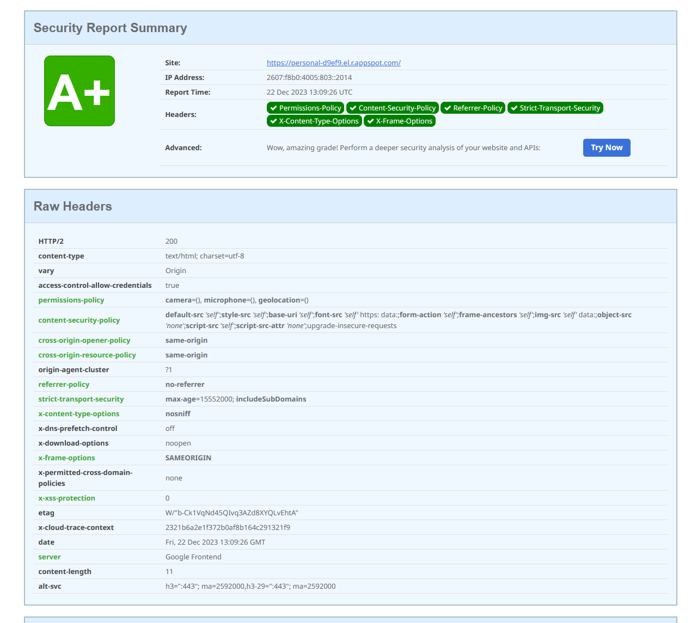
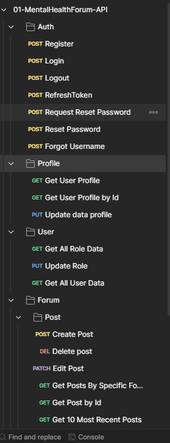
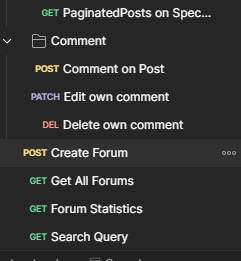

# GFP - Good Health & Well Being (Backend)

### Technology Used:

    

   

## Brief Description

#### Project Theme
Good Health & Well Being

#### Project Purpose:
Anyone, either they are a teenager, young adult, or adult sometimes face many significant challenges in their lifetime. This increases the chance of various mental health issues. Since mental health issues are diverse and complex, individuals who struggle with any mental health issues sometimes find themselves isolated and struggle to find a safe space where they can share their experiences freely, seek advice, or receive empathy from others who faced the same issue. We understand that professional help is the most important and irreplaceable, but seeking advice or support from those who share the same experiences or tips provides a different layer of understanding and comfort.

#### Deliverables
This section provides an overview of the backend functionalities of Health Haven Forum, a comprehensive platform for discussions on health and well-being.

- Key Features:
  - User Authentication: Secure login and registration system with support for session management.
  - Forum Management: APIs to create, read, update, and delete forum posts.
  - Comment System: Functionality to add, view, and manage comments on forum posts.
  - Profile Management: User profile creation and editing capabilities, including image uploads.

#### Guide to use this app on local
1. Git clone this repository.
2. Use `npm install` on root folder to install all depedency packages.
3. We have .env file, so you need to configure your own .env.
4. Refer to `.env.example` file on root directory.
5. Then to start the project on your local development `npm start`. 

### Deployment && Screenshots
**Notes: this backend/server is deployed on Gcloud App Engine** 
#### Website Link: [HealthHavenForum](https://health-haven-forum.web.app/)
#### API-Documentation: [Postman](https://documenter.getpostman.com/view/25001166/2s9YkrbKp3)

#### If you want to see the client-side code go to this repo:
Client-side repo: [Visit](https://github.com/aghfairawan/Mental-Health-Forum-Application)

#### Screenshots

