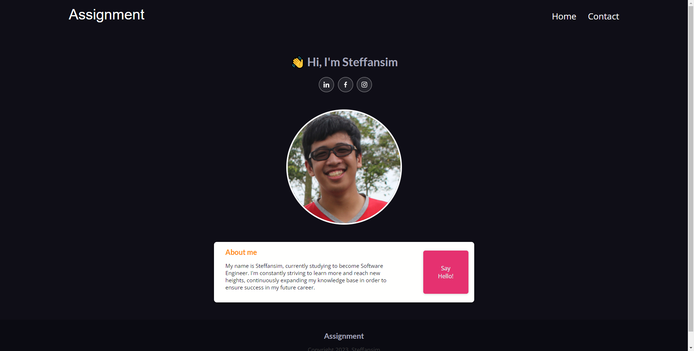

# Simple Website using HTML, CSS, & JavaScript.

This website is made for RevoU assignment.  
The website is about short self-introduction,
and the purpose is to demonstrate or implement what I have learned in class into this simple website.

## This is the website link
Click here: https://steffan-revou-week1.netlify.app/

### Website Screenshot

  

