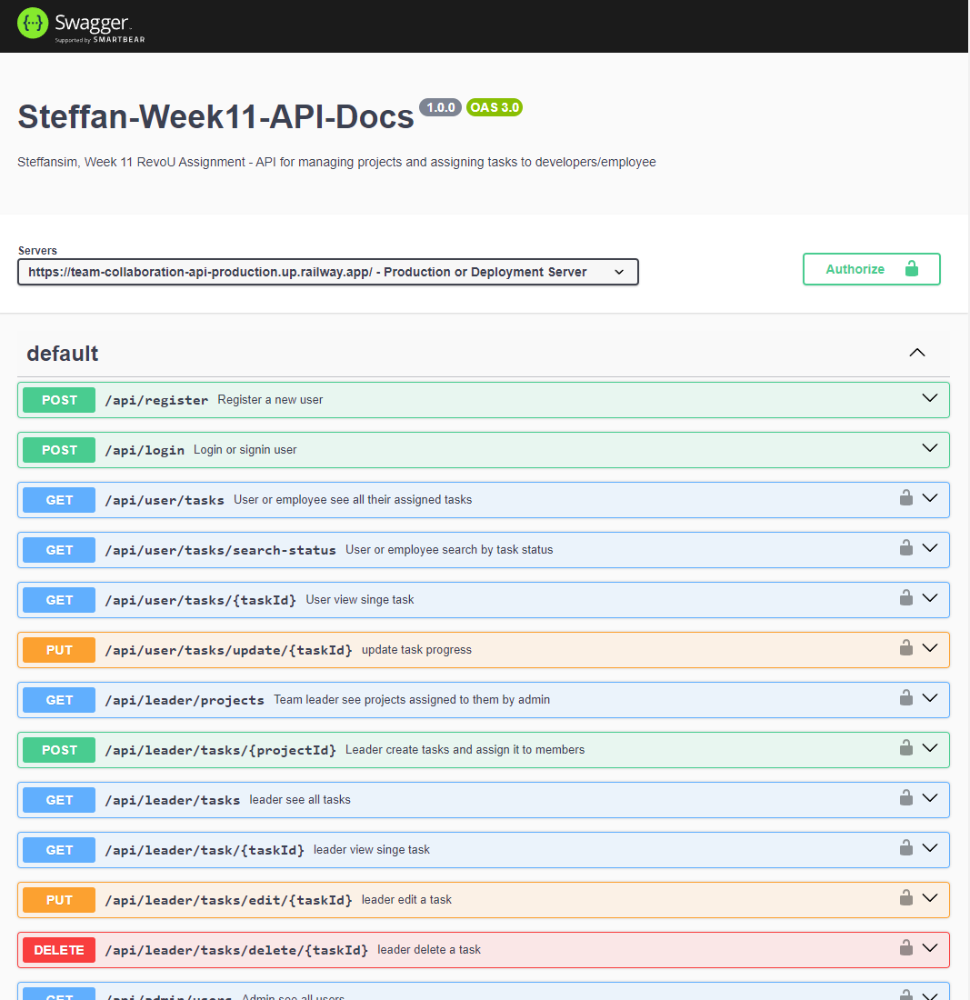

# Team Collaboration Management Api

### Technology Used:

<p align="left">    


                
</p>

## Brief Description

#### Assignment Purpose:

This project is made for RevoU assignment.<br>
The purpose of this assignment is to build a web application based on theme of my own choice. The web app should integrate with a database through a custom-built API and implement CRUD functionality.

#### About this app:

This API is designed for project management application. It is used a as team collaboration tool to divide tasks or to assign tasks to each of team members. This API has a functions for creating, tracking, and prioritizing tasks to make the teams stay organized and efficient with their ongoing projects. Admin or superuser can create a project then formed a group and assign that project to that group to handle. Each group have one team leader and several members assigned by Admin. Team leader can assign tasks, set due dates, and monitor progress. The members will be able to see their own assigned tasks, then proceed on working for that tasks, and members can set the status of the tasks to 'in-progress' and 'completed'.

- Key Features:
  - User Registration:
    - Anyone can register with a field `username, email, password`.
    - `username` must not be blank and each `username` is unique.
    - `role` default value is `user`
  - Password Requirements:
    - Each user password must have a minimum length of 8 chars.
    - Is alphanumeric
    - Is hashed when storing in MongoDB database.
  - Login:
    - Login with `username` & `password`, the return response will be `accessToken` or `bearer token` to access certain endpoints for this app
  - Authentication & Authorization:
    - Using JWT to authenticated specific endpoints & manage role based control.
  - Roles:
    - `Admin` roles is a superuser on this app.
    - `Admin` is used to create a project and group.
    - `Admin` able to see all projects, groups created, and all users.
    - `Admin` must assign a leader and several members to a group.
    - `Admin` will assign a group to handle the project.
    - Team `Leader` will able to see their assigned projects along with the group members.
    - The `Leader` then create the tasks need to complete a project and assign it to group members.
    - `Leader` also able to edit the tasks that has been created and also permanently delete task with `pending` status only.
    - `Leader` will be able to see all the tasks or single task to keep track or monitor progress
    - `Team Members` is a user with the role `user`.
    - `User` will be able to see all their own assigned tasks or view a singel task.
    - `User` then will be able to update their progress on each tasks assigned, status update `in-progress` or `completed`.
    - `User` will also be able to search the task by it status `pending`, `in-progress`, or `completed`.

#### Guide to use this app

1. Git clone this repository.
2. Open the project and start with `npm install`, this will install all dependencies.
3. Create your own `.env` file (this will contain sensitive data or variables for your project.)
   - Below is the example:

```env
PORT=your_defined_port
MONGODB_URI=your_mongodb_uri
JWT_SECRET=your_jwt_secret
```

4. Run `npm start` to start the project, you will get a notification like this `Server listening on port PORT_NUMBER` & `Successfully connect to MongoDb`
5. Now you have successfully run the project.
6. Try and see the api-documentation by accessing `localhost:PORT_NUMBER/api-docs`

### Deployment

#### This project is deployed using railway.app

If you want to test and see this app api-endpoint and its functionality as mentioned in `key features` above, you can visit the link below <br>

### You can access the api-documentation here : [Link Here!](https://team-collaboration-api-production.up.railway.app/api-docs/)

[View openapi.yaml here](./src/doc/openapi.yaml)<br>
**Notes: When registering you can decide what role is for that user by making role field and input either user, admin, or leader.**<br>
Don't Forget to switch the `Server` to deployment or production.<br>
You can try accessing endpoints with this created accounts that I prepare for you, try `login` to get the `JWT or Bearer Token`.

```json
{
    "username": "Admin",
    "password": "zxc12345"
}

{
    "username": "User",
    "password": "zxc12345"
}

{
    "username": "Leader",
    "password": "zxc12345"
}

```
### Screenshot


[](https://classroom.github.com/a/XqBuIcOG)
