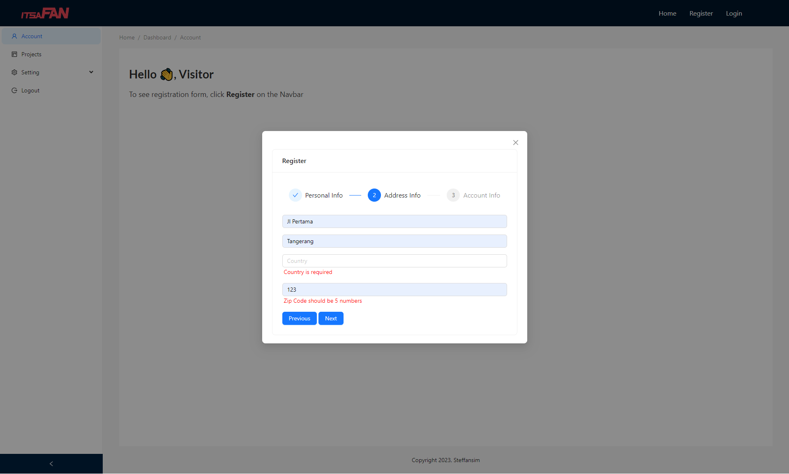
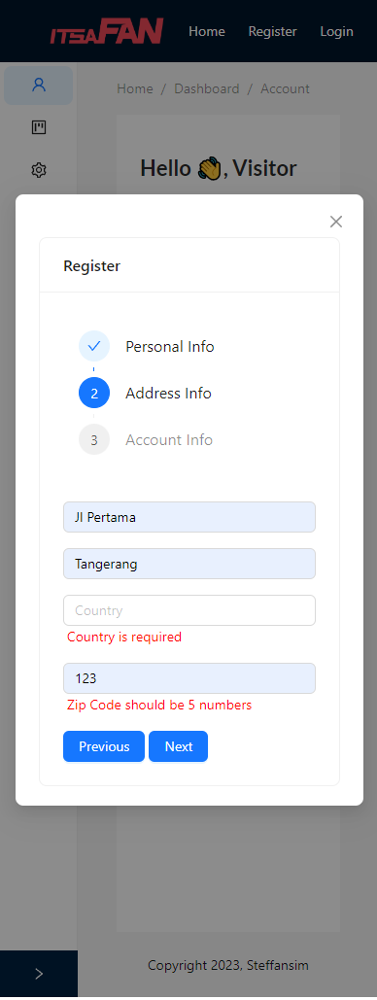

# Multi-Step Registration Form using React

### Technology Used:

    

         

## Brief Description

#### Assignment Purpose:

This project is made for RevoU assignment. 
The purpose of this assignment is to build a multi-step registration form on React using Formik and Yup for client-side validation. Use useState to manage the form's state and progress through the steps. The registration forms should be able to navigate between steps so the user can make corrections on their inputs.

- Multi-Step Registration Features:
  - Step 1: Personal Information
    - First Name (required)
    - Last Name (required)
    - Email (required, valid email format)
    - DoB (required, max-date limit validation)
  - Step 2: Address Information
    - Stress Address (required)
    - City (required)
    - Country (required)
    - Zip Code (required, min length 5, numbers)
  - Step 3: Account Information
    - Username (required)
    - Password (required, alphanumeric, min-length 6)

#### Guide to use this app

1. Git clone this repository.
2. Open the project and start with `npm install`, this will install all dependencies.
3. Run `npx vite` to start the project.
4. Now you have successfully run the project.

## Website Link

Click here: [Steff-Revou-Week12](https://steff-revou-week12.netlify.app/)

## Website Preview

### Responsive View Screenshot

<table>
  <tr>
    <td align="center" style="vertical-align: top;">
      
    </td>
  </tr>
  <tr>
    <td align="center" style="vertical-align: top;">
      
    </td>
  </tr>
</table>

