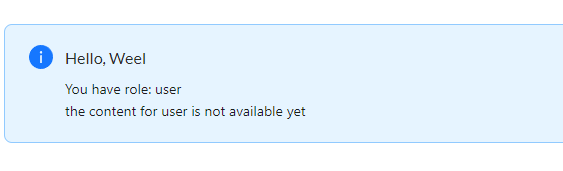
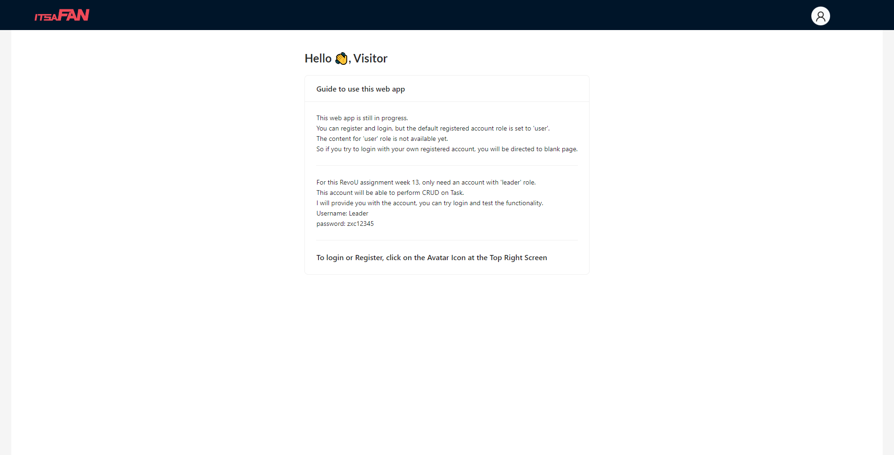
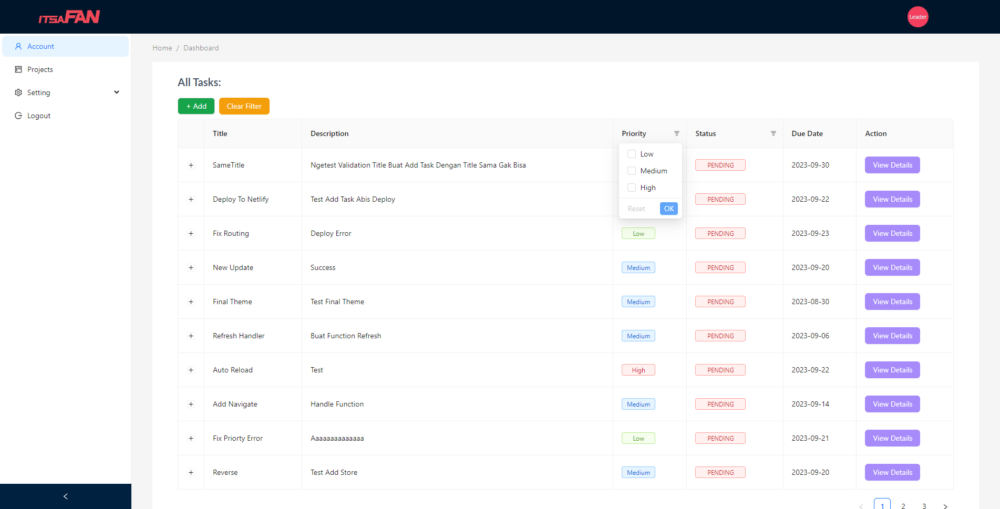
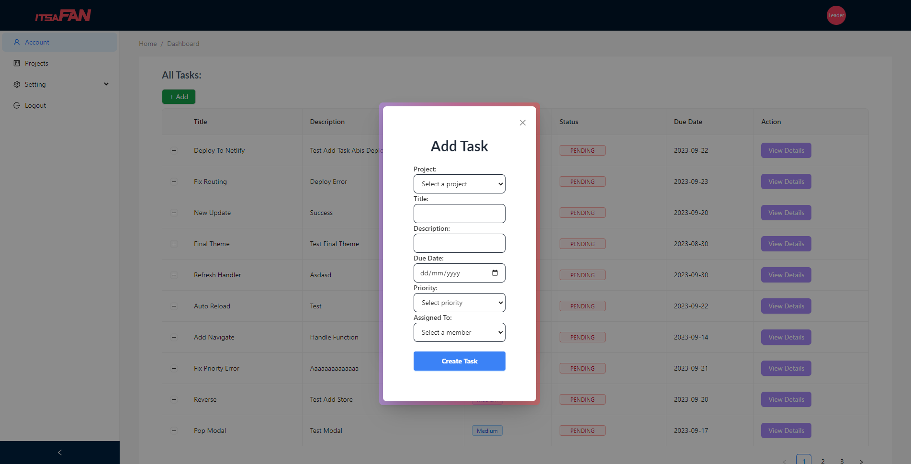
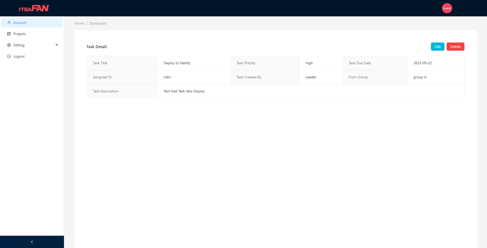
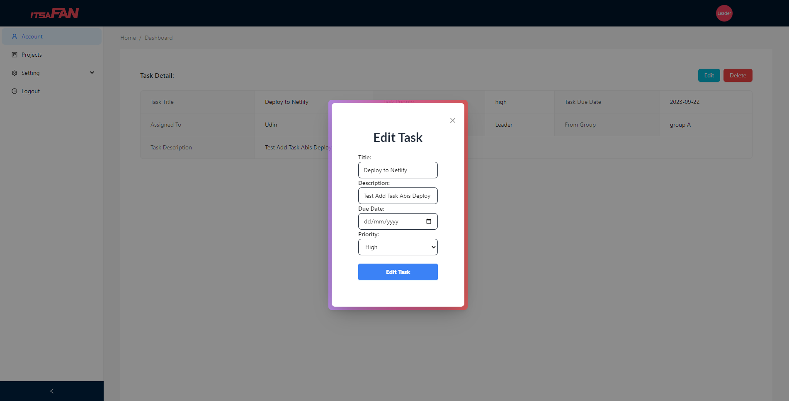
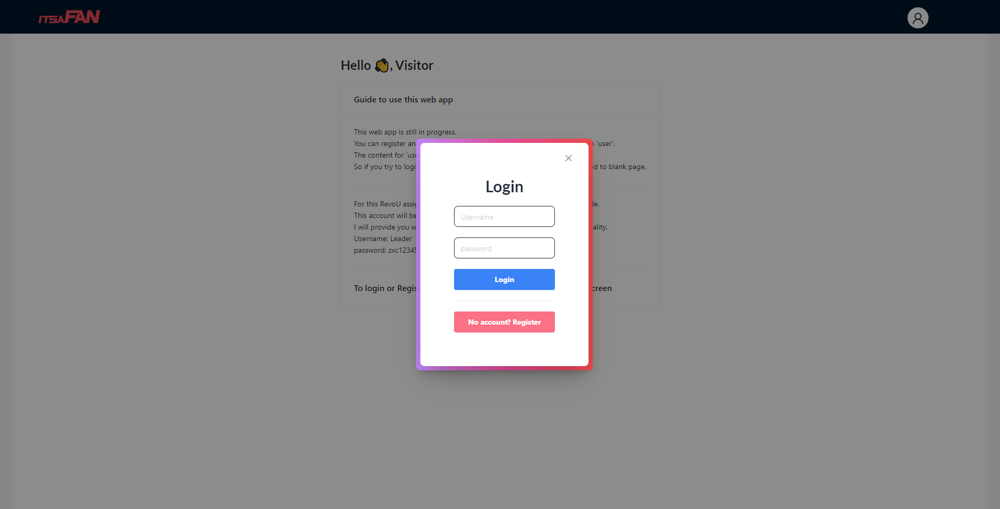
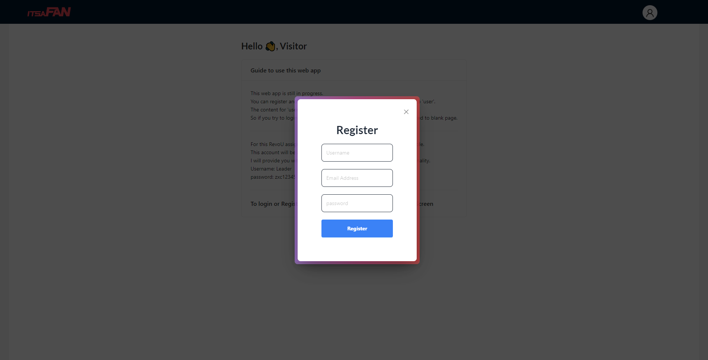

# RevoU Week 13 - Assignment

### Technology Used:

<p align="left">    

         
</p>

## Brief Description

#### Assignment Purpose:

This project is made for RevoU assignment.<br>
The purpose of this assignment is to learn React conepts and features. Learnig about React Lifecycle methods and how to use them in components. Exploring Hooks and how to use them to manage state and other features. Understand React Context to manage global state in our ap.

- This App Features:
  - Register
  - Login
  - Show All Tasks
  - Filter task `priority` and `status`
  - Create Task
  - Prevent creating the same task `title`
  - View single task
  - Edit Task
  - Delete Task
  - Token Authorization
  - Role Based Authentication

#### Guide to use this app

1. Git clone this repository.
2. Open the project and start with `npm install`, this will install all dependencies.
3. Run `npx vite` to start the project.
4. Visit the link & see further guide there on `landing page`.
5. Don't forget to login with this data:

```json
{
  "username": "Leader",
  "password": "zxc12345"
}
```
6. You can try register an account, then login with that registered account.
7. Since default registered account role is set to `user`, you will receive this instead on `Dashboard page`:


## Website Link

Click here: [Steff-Revou-Week13](https://steff-revou-week13.netlify.app/)

## Website Preview

<table>
  <tr>
    <td align="center" style="vertical-align: top;">
      
    </td>
  </tr>
  <tr>
    <td align="center" style="vertical-align: top;">
      
    </td>
  </tr>
    <tr>
    <td align="center" style="vertical-align: top;">
      
    </td>
  </tr>
    <tr>
    <td align="center" style="vertical-align: top;">
      
    </td>
  </tr>
    <tr>
    <td align="center" style="vertical-align: top;">
      
    </td>
  </tr>
    <tr>
    <td align="center" style="vertical-align: top;">
      
    </td>
  </tr>
    <tr>
    <td align="center" style="vertical-align: top;">
      
    </td>
  </tr>
</table>

[](https://classroom.github.com/a/Vqy8tqrT)
