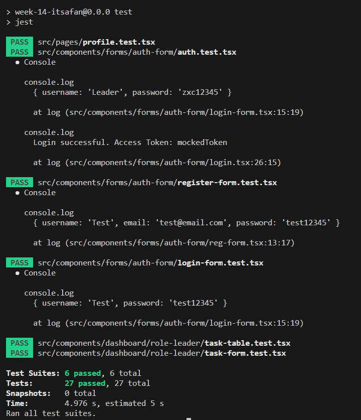

# RevoU Week 14 - Assignment Unit Testing

### Technology Used:

    

         

## Brief Description

#### Assignment Purpose:

This project is made for RevoU assignment. 
The purpose of this assignment is to learn about Unit Testing on React. The testing for this assignment wil used the project from [previous week 13](https://github.com/RevoU-FSSE-2/week-13-itsaFan). The testing cover this list of scenarios:

- Login
  - unit test not fail
  - unit test can detect input form
  - unit test can detect login button
- Register
  - unit test not fail
  - unit test can detect input form
  - unit test can detect register button
- Task
  - all unit test not fail
  - unit test can detect tasks-table
  - unit test can detect add task form and edit task form
- Profile Page
  - unit test not fail
  - unit test can detect title for the profile page

#### Guide to use this app

1. Git clone this repository.
2. Open the project and start with `npm install`, this will install all dependencies.
3. Run `npm run test` to see if any unit testings failed or passed.
4. (optional) You can also `npx vite`, if you want to see this app on browser.

### Path to each test files:

- [Login Form Test](./src/components/forms/auth-form/login-form.test.tsx)
- [Register Form Test](./src/components/forms/auth-form/register-form.test.tsx)
- [Auth Test](./src/components/forms/auth-form/auth.test.tsx)
- [Task Table Test](./src/components/dashboard/role-leader/task-table.test.tsx)
- [Task Form Test](./src/components/dashboard/role-leader/task-form.test.tsx)
- [Profile Page Test](./src/pages/profile.test.tsx)

## Unit Test Result Preview

 

