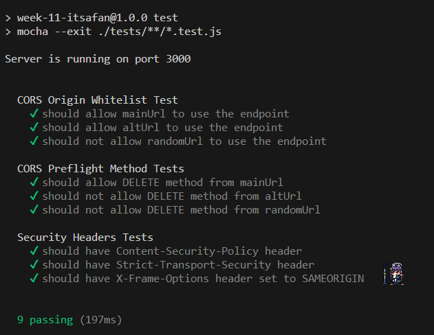
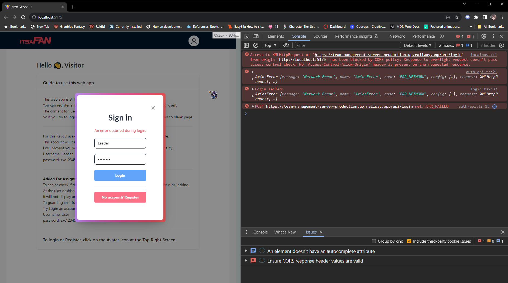
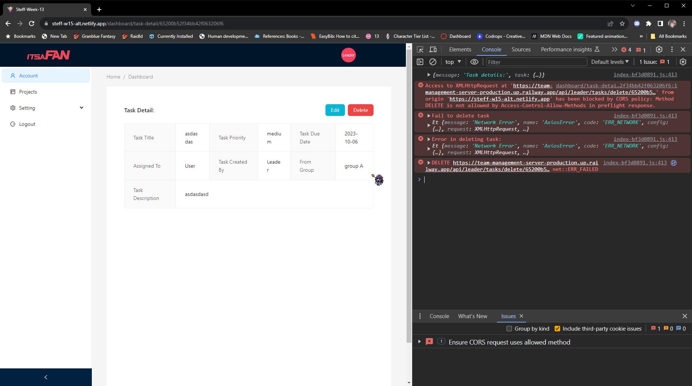
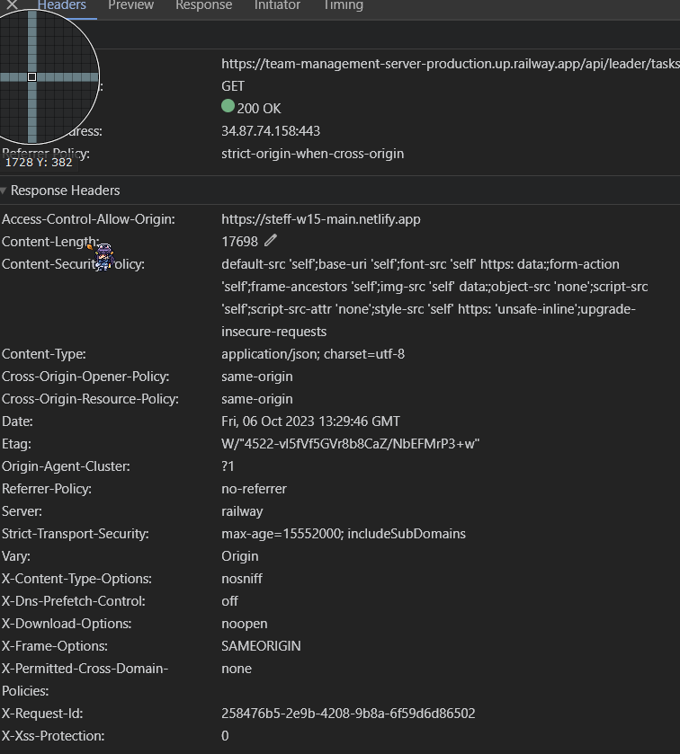
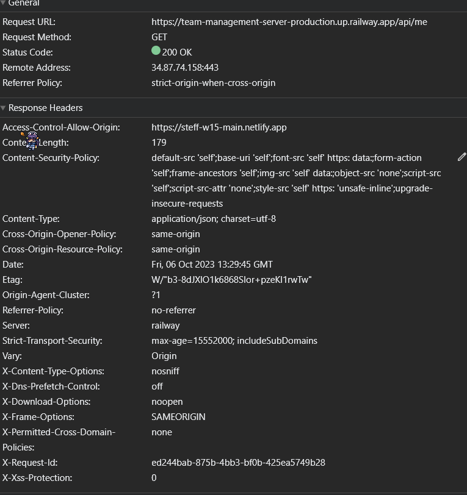

# Week-15: CORS & Headers Implementation

### Technology Used:

<p align="left">    


 
</p>

## Brief Description

#### Assignment Purpose:

This project is made for RevoU assignment.<br>
The purpose of this assignment is to help us understand http headers and its usage. To learn and practice about CORS, implementing security headers, and practice about layering structure for middlewares.

- Milestones:
  - X-Request-Id for every GET, POST, DELETE, PUT requests.
  - CORS: restricting access-control-origin only for two clients.
  - CORS: restricting & customizing preflight access-control-methods for two clients: `Main Client` able to do all methods while  `Alt Client` only `GET` `POST`.
  - Prevent click-jacking & xss attact by using `helmet` package.
  - Perform unit test for `CORS` and `Security Headers`.
  - Auto create log folder & file for tracking request and response by using `morgan` package.

#### Guide to use this app

1. Git clone this repository.
2. Use `npm install` on both `client-side` & `server-side` folder to install all depedencies.
3. Both `client-side` & `server-side` have .env file, so you need to configure your own .env.
4. Refer to `.env.example` file on `client-side` & `server-side` root directory.
5. Then to start the project, turn on the server `npm start` & turn on client `npx vite`

### Path to each test files:

- [CORS Test](./server-side/tests/cors.test.js)
- [Security Headers Test](./server-side/tests/security-headers.test.js)

### Deployment && Screenshots

**Notes: this project have two clients to test the CORS preflight methods restriction**<br>
Try login to each client with these accounts below.
Login with `Leader` account and try deleting or editing a task on each client, you will see that on `Alt Client` you are not able to delete or edit.<br>
Login with `User` account to see the `iframe` tag doesn't work.

#### Website Link: [Main Client](https://steff-w15-main.netlify.app/) & [Alt Client](https://steff-w15-alt.netlify.app/)

```json
{
    "username": "User",
    "password": "zxc12345"
}

{
    "username": "Leader",
    "password": "zxc12345"
}
```

#### Screenshots

Unit Testings


---
Unable to use API because CORS origin 


---
Unable to delete because method restriction 


---
X-Request-Id Example: 


---


---
[](https://classroom.github.com/a/A8ztcAuX)
