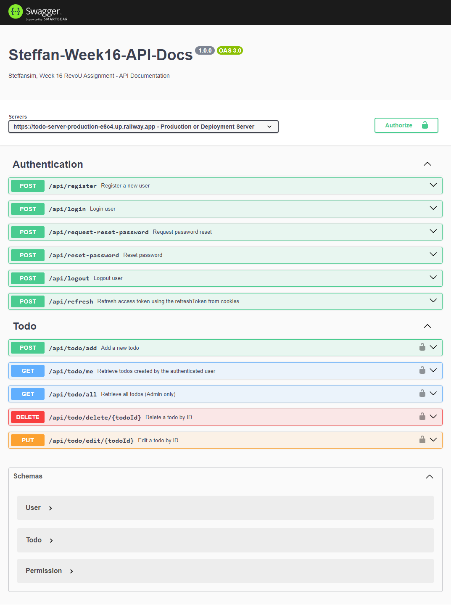

# Week 16 - Assignment

### Technology Used:

<p align="left">    


                
</p>

## Brief Description

#### Assignment Purpose:

This project is made for RevoU assignment.<br>
The purpose of this assignment is to learn about JWT and apply it on our app for authentication and authorization purpose.

- Milestones:

  - Create `Register` & `Login` endpoints.
  - Generate `accessToken` & `refreshToken` after successfuly login request.
  - Inject `refreshToken` to cookie and response body `accessToken`.
  - Create `logout` to clear the cookie.
  - Implement `ResetPasswordRequest` & `ResetPassword` endpoint.
  - Using `nodemailer` to make dummy email for `reset password request`
  - Implementing `roles` for authorization purpose
  - Limiting / lockout login attempt by IP & Username, Email, or Password
  - Blacklist `refreshToken` & `accessToken` after hitting logout endpoint.
  - Denying tokens that has been blacklisted.

- Key Features:
  - User Registration:
    - Anyone can register with a field `username, email, password`.
    - `username` must not be blank and each `username` is unique.
    - `role` default value is `ROLE_USER`
  - Password Requirements:
    - Each user password must have a minimum length of 8 chars.
    - Is alphanumeric
    - Is hashed when storing in MongoDB database.
  - Login:
    - Login with `username or email` & `password`, the return response will be `accessToken` or `bearer token` to access certain endpoints for this app.
    - `refreshToken` will be stored on the cookie, to regenarate new `accessToken` if the current `accessToken` expired.
    - Login attemps is limited per IP address & failed attemps is limited by wrong input.
  - Authentication & Authorization:
    - Using JWT to authenticated specific endpoints & manage role based control.
  - Roles:
    - `ROLE_ADMIN` roles is a superuser on this app.
    - `ROLE_ADMIN` is able to view all todos on database, and `update` `delete` any todos.
    - `ROLE_USER` roles is default role when user register.
    - `ROLE_USER` only able to `view`, `edit`, & `delete` their own todos
  - Logout:
    - Upon logout, the cookies will be cleared and both tokens will be stored on `memory-cache` for blacklisting purpose.
    - Any blacklisted tokens will not be able to authenticate.

#### Guide to use this app

1. Git clone this repository.
2. For this project, we only need `server` folder.
3. Use `npm install` on `server` folder to install all depedencies.
4. `Server` have .env file, so you need to configure your own .env.
5. Refer to `.env.example` file on `server` root directory.
6. Then to start the project, turn on the server with `npm start`.

### Deployment && Screenshots

**Notes: this project only required server**<br>
If you want to test and see this app api-endpoint and its functionality as mentioned in `key features` above, you can visit the link below <br>

[View openapi.yaml here](./server/src/doc/openapi.yaml)<br>
### You can access the api-documentation here : [Link Here!](https://todo-server-production-e6c4.up.railway.app/api-docs/)
Don't Forget to switch the `Server` to deployment or production.<br>
If you don't want to register, you can try accessing endpoints with this created accounts that I prepare for you, try `login` to get the `accessToken` to put it into headers.authorization & `refreshToken` will be stored on cookies..

```json
{
    "username": "admin",
    "password": "zxc12345"
}

{
    "username": "Test",
    "password": "zxc12345"
}
```


### Screenshot



[](https://classroom.github.com/a/GB9tUzun)
