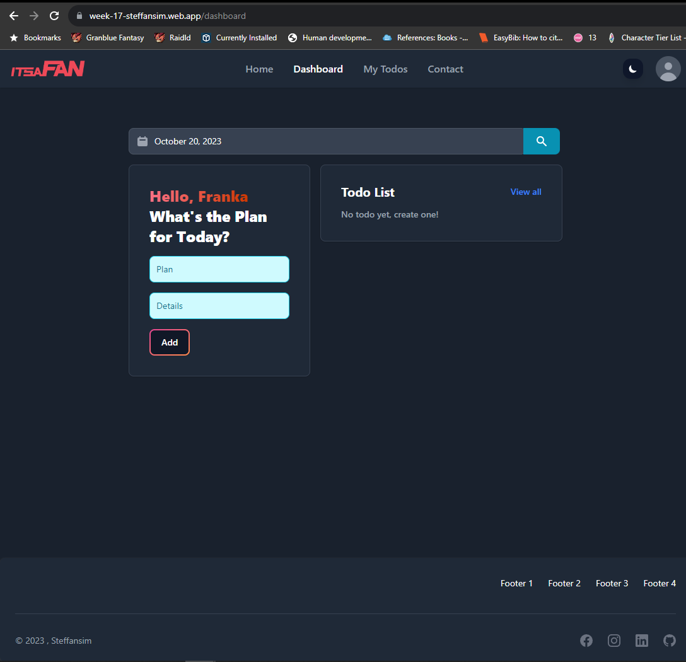

# Week 17 - Assignment

### Technology Used:

<p align="left">    


       
</p>

## Brief Description

#### Assignment Purpose:

This project is made for RevoU assignment.<br>
The purpose of this assignment is to learn about Fullstack Integration. Based on the front-end website and back-end that we developed from previous weeks, integrate it into full end to end product.

- Milestones:
  - Fullstack development fundamental.
  - Frontend and Backend Deployment on Firebase.
  - Web Quality Knowledge
  - SE best practices
  - DevOps

#### Guide to use this app

1. Git clone this repository.
2. Use `npm install` on both `client` & `functions` folder to install all depedencies.
3. Both `client` & `functions` have .env file, so you need to configure your own .env.
4. Refer to `.env.example` file on `client` & `functions` root directory.
5. Then to start the project on your local development. First on `functions`, You need to uncomment `app.listen` & comment or remove the exports
   ```javascript
   // app.listen(config.port, () => console.log(`Server is running on http://localhost:${config.port}`));
   exports.week_17_steffansim = functions.https.onRequest(app)
   ```
6. Then run `npx vite` on `client`.

### Deployment && Screenshots
**Notes: this project is deployed using Firebase provided by our instructor**<br>
#### Website Link: [Client](https://week-17-steffansim.web.app/)


#### Screenshots




[](https://classroom.github.com/a/B55J7eQC)
