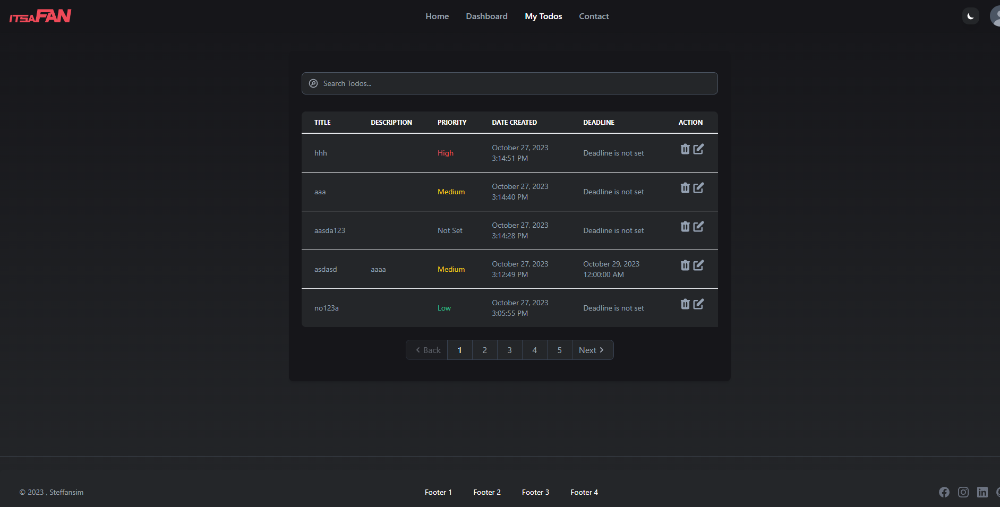
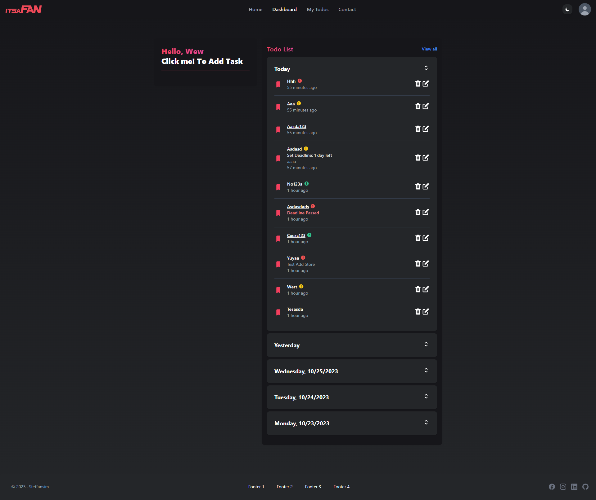
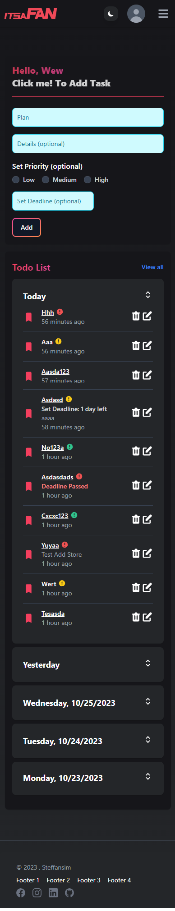
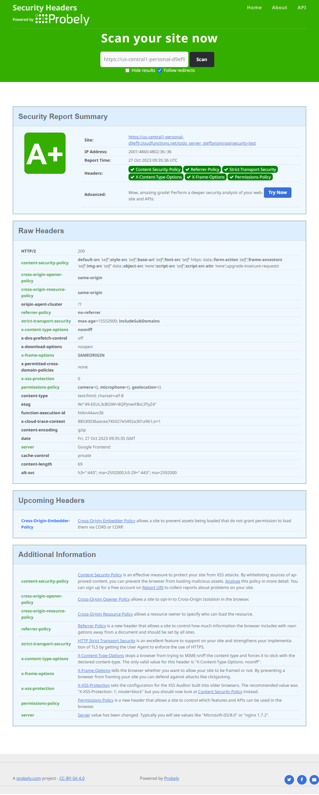
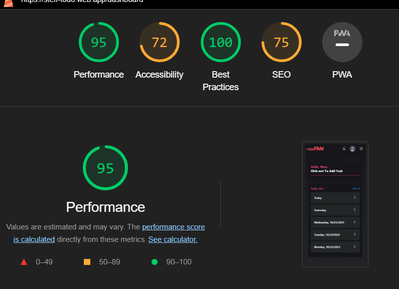

# Week 18 - Mini-Milestone Project

### Technology Used:

<p align="left">    


       
</p>

## Brief Description

#### Assignment Purpose:

This project is made for RevoU assignment.<br>
The purpose of this assignment is to create a comprehensive Todo List application with database integration, role-based access control, user authentication, security headers, a React frontend using hooks and context, API documentation, and deployment on a VPS.

- Key Features:
  - User Registration:
    - Anyone can register with a field `username, email, password`.
    - Each `username` is unique.
    - `role` default value is `ROLE_USER`
  - Password Requirements:
    - Each user password must have a minimum length of 8 chars.
    - Is alphanumeric
    - Is hashed when storing in MongoDB database.
  - Login:
    - Login with `username` & `password`, the return response will be `accessToken` and set `refreshToken` to cookies.
  - Authentication & Authorization:
    - Using JWT to authenticated specific endpoints & manage role based control.
  - Roles:
    - `ROLE_ADMIN` roles is a superuser on this app.
    - `Admin` is able to perform CRUD on Todos, and able to see and delete todos created by another user account.
    - `User` will be able to perform CRUD on Todo
    - They only able to see their own created Todo and delete their own.
  - Security Headers Configuration
    - X-Request-Id for every POST, DELETE, PUT requests
    - CORS: Setting access-control-origin and methods
    - CORS set - only allowing registered origin to access
    - Set CSP, Referrer-Policy, Strict-Transport-Security, X-Content-Type-Options, X-Frame-Options, Permissions-Policy.
  - Frontend
    - Using React to build Todo List App
    - Implementing `useState`, `useRef`, `useContext`, `useEffect`, ect
  - Using Swagger for Backend API documentations.
  - Deployed using Firebase Hosting for client & Firebase Functions for server.

#### Guide to use this app

1. Git clone this repository.
2. Use `npm install` on both `client` & `functions` folder to install all depedencies.
3. Both `client` & `functions` have .env file, so you need to configure your own .env.
4. Refer to `.env.example` file on `client` & `functions` root directory.
5. Then to start the project on your local development. First on `functions`, You need to uncomment `app.listen` & comment or remove the exports, also you can uncomment the swagger config to access /api-docs on localhost.
   ```javascript
   // app.listen(config.port, () => console.log(`Server is running on http://localhost:${config.port}`));
   exports.todo_server_steffansim = functions.https.onRequest(app);
   ```
6. Then configure the `BASE_URL` on `.env` clientside, then run `npx vite`.

### Deployment && Screenshots
**Notes: this project is deployed using Firebase**<br>
#### Website Link: [Client](https://steff-todo.web.app/)
#### API-Documentation: [Server](https://todo-list-server-production-6c12.up.railway.app/api-docs/)


#### Screenshots







[](https://classroom.github.com/a/-Z3-Ss4P)
