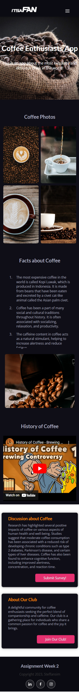

# Simple Coffee Enthusiast Website.

### Technology Used:

                

## Brief Description

This website is made for RevoU assignment.
The purpose for this assignment is to implement responsive design about anything that I like. Since I love coffee and always drink it everyday, then I decided to make the website about coffee. This website design based on the example provided for the assignment.

## This is the website link:

Click here: [Coffee Website](https://steffan-revou-week2.netlify.app/)

### Desktop and Mobile View Screenshots

<table>
  <tr>
    <td align="center" style="vertical-align: top;">
      
    </td>
    <td align="center">
      
    </td>
  </tr>
</table>

### Survey and Register Button Modal:

<table>
  <tr>
    <td align="center" style="vertical-align: top;">
      
    </td>
    <td align="center">
      
    </td>
  </tr>
</table>

