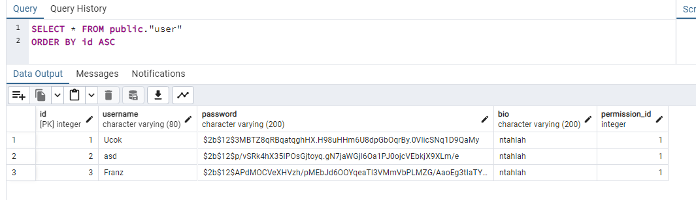
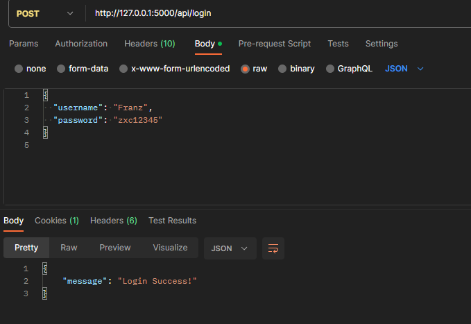
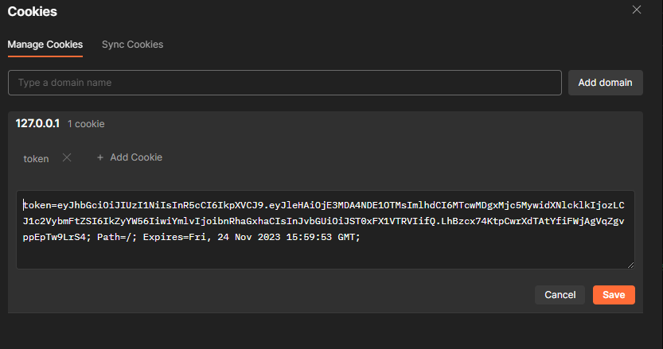
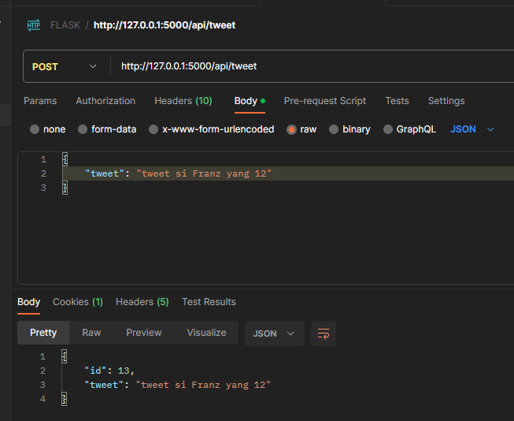
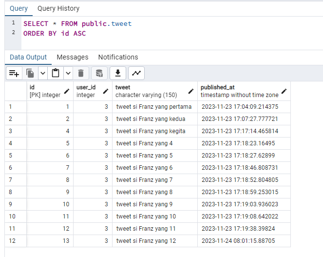
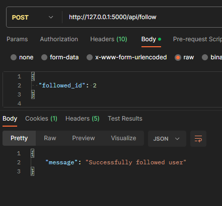
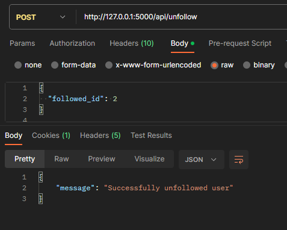
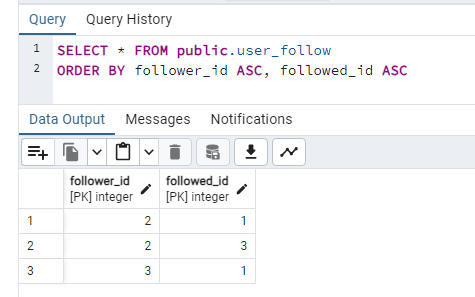
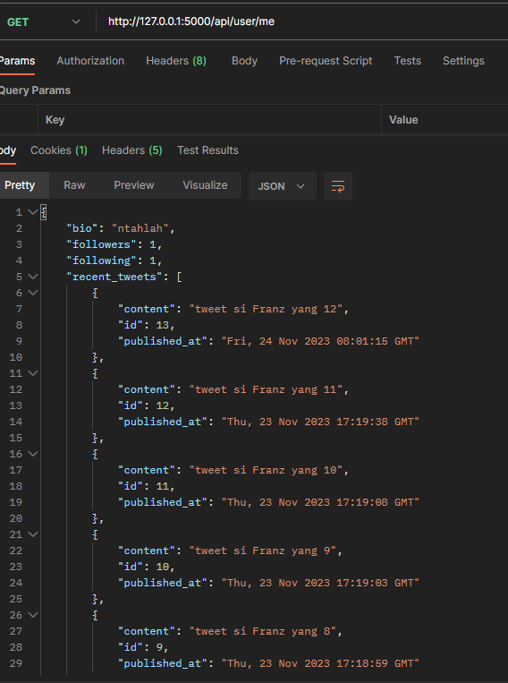

# Week 21 - Twitter-Like API Development with Flask

### Technology Used:

    

         

   

## Brief Description

#### Assignment Purpose:

This project is made for RevoU assignment. 
The purpose of this assignment is to build a simplified version of a Twitter API using Flask. it will test our understanding of backend development and python language. Since it's twitter like API, the project will have register and login, posting tweets, follow/unfollow, and viewing user profile.

- Key Features:
  - User Registration:
    - Anyone can register with a field `username, password, bio`.
    - Each `username` is unique.
    - The default permission or role of the created user is `ROLE_USER`
  - Password Requirements:
    - The password input from the user will be hashed on the database.
  - Login Functionality:
    - Each login attempt will generate a `JWT-Token` which will be stored on the user client cookies.
    - Validation for invalid username or password.
  - Posting Tweet Functionality:
    - When user is loggedin, they will have access to this endpoint `(authentication)`.
    - The tweets will have maximum of 150 characters.
  - Follow Functionality
    - When user is loggedin, they will have access to this endpoint `(authentication)`.
    - This function will enable users to follow or unfollow another users.
    - It will prevent the user from following themselves.
    - It will prevent the user from following the same person twice.
    - It will have validation if the user trying to unfollow the person that they're not following.
  - View Own Profile Functionality
    - When user is loggedin, they will have access to this endpoint `(authentication)`.
    - User can see or retrieved their profile when logged-in.
    - The profile information includes `username`, `bio`, `followers`, `following`m and `10 most recent tweets`

#### Guide to use this app

1. Git clone this repository.
2. Install all packages if required.
3. Look at `.env.example` input your own jwt-secret key and postgreURI.
   - the `postgreSQL` URI is based on `SQLAlchemy` so it should look similar like this `postgresql://name:password@ip_addresss/database_name`
4. Then start the project using `pipenv shell ` & `flask run`
5. Test the endpoints.

#### API endpoints
| API             | Purpose             | Method| Request Body Fields   |
| -------------   |:-------------------:| -----:| ---------------------:|
| /api/register   | Registration        | POST  |username, password, bio|
| /api/login      | Login               | POST  |username,password      |
| /api/tweet      | Posting Tweet       | POST  |tweet                  |
| /api/follow     | Follow other user   | POST  |followed_id            |
| /api/unfollow   | Unfollow other user | POST  |followed_id            |
| /api/user/me    | View profile        | GET   |-                      |

#### Screenshots

