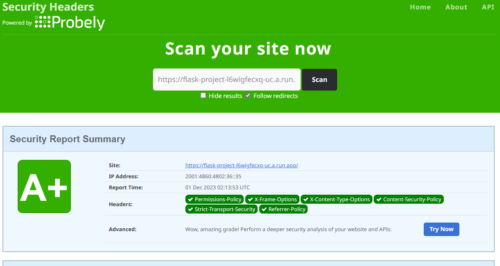
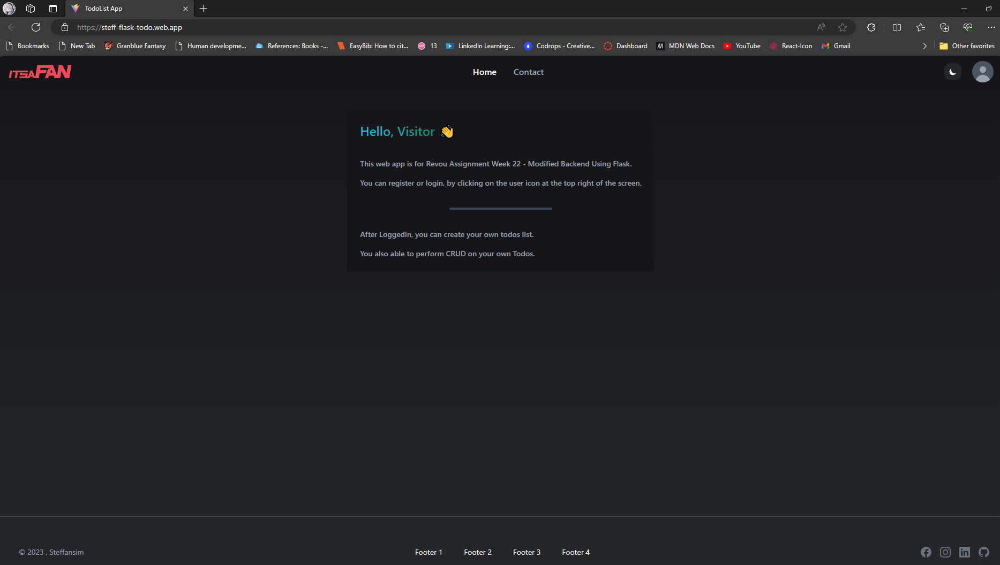
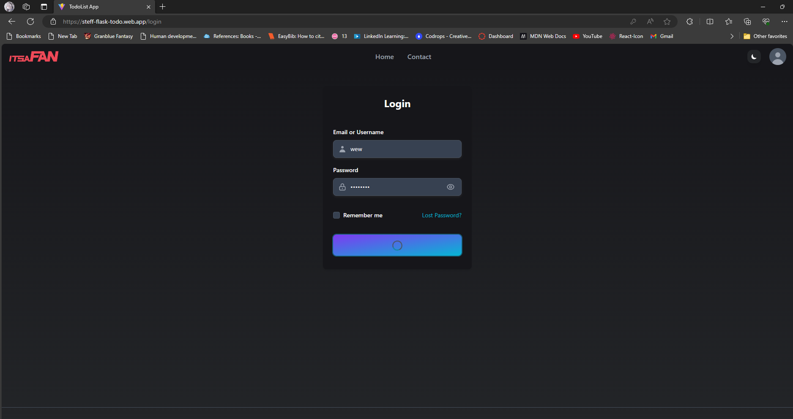
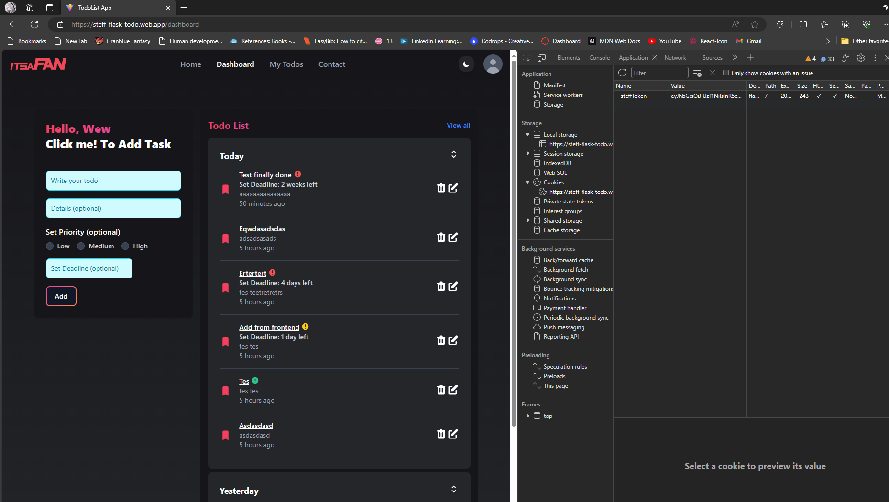
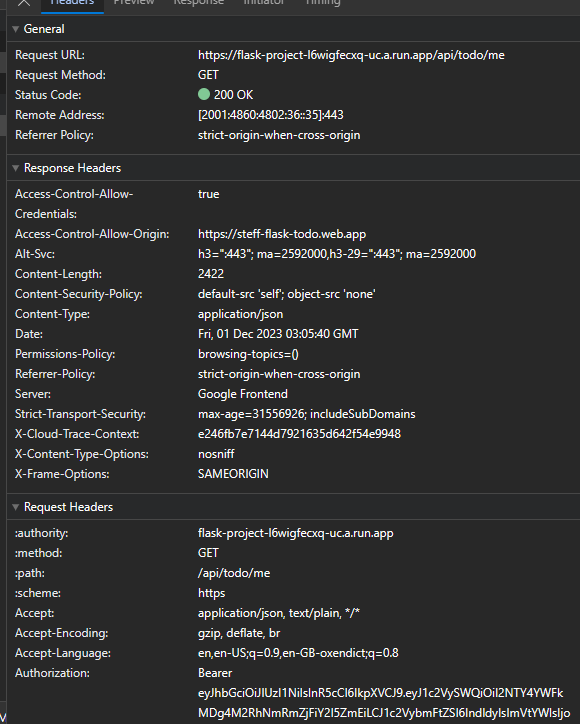
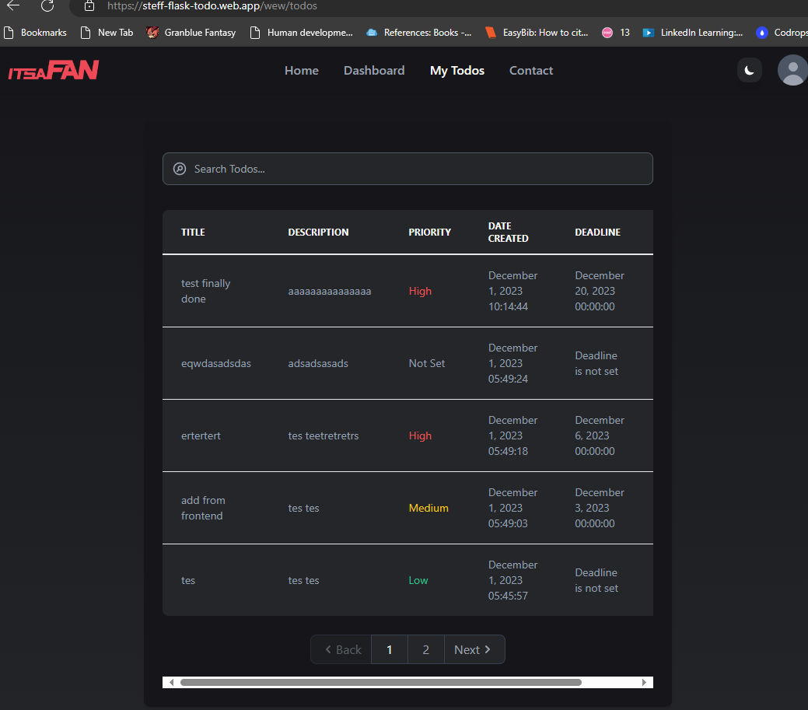
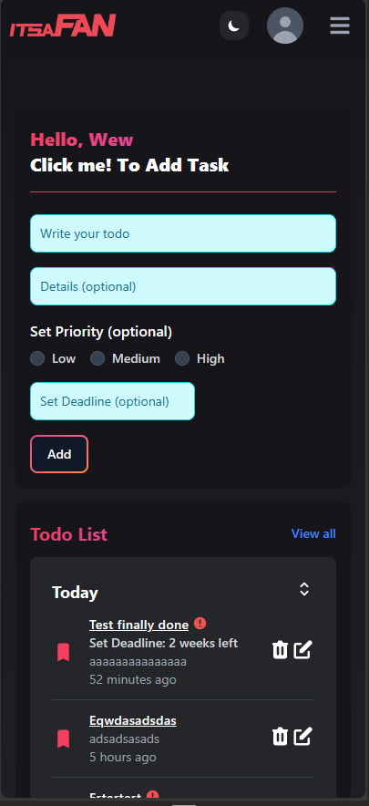

# Week 22 - Project MileStone 5

### Technology Used:

    

         

 
 

  

## Brief Description

#### Assignment Purpose:

This project is made for RevoU assignment. 
The purpose of this assignment is to convert the existing todolist backend/expressJs that we created weeks ago to Flask. It include all previous weeks features like database intergration, role-based control, user authentication, security-headers, and CRUD on Task/Todo.

- Key Features:
  - User Registration:
    - Anyone can register with a field `username, email, password`.
    - Each `username` is unique.
    - `role` default value is `ROLE_USER`
  - Password Requirements:
    - Each user password must have a minimum length of 8 chars.
    - Is alphanumeric
    - Is hashed when storing in MongoDB database.
  - Login:
    - Login with `username` & `password`, the return response will be `accessToken` and set `refreshToken` to cookies.
  - Authentication & Authorization:
    - Using JWT to authenticated specific endpoints & manage role based control.
  - Roles:
    - `ROLE_ADMIN` roles is a superuser on this app.
    - `Admin` is able to perform CRUD on Todos, and able to see and delete todos created by another user account.
    - `User` will be able to perform CRUD on Todo
    - They only able to see their own created Todo and delete their own.
  - Security Headers Configuration
    - CORS: Setting access-control-origin and methods
    - CORS set - only allowing registered origin to access
    - Set CSP, Referrer-Policy, Strict-Transport-Security, X-Content-Type-Options, X-Frame-Options, Permissions-Policy.
  - Frontend
    - Using React to build Todo List App
    - Implementing `useState`, `useRef`, `useContext`, `useEffect`, ect
  - Using Swagger for Backend API documentations.
  - Deployed using Firebase Hosting for client & Firebase Functions for server.

#### Guide to use this backend API

1. Git clone this repository.
2. Install all packages if required.
3. Look at `.env.example` set your own env configuration.
4. Then start the project using `pipenv shell ` & go to `src` directory then `flask run`
5. Test the endpoints. 

#### API endpoints
| API             | Purpose             | Method| Request Body Fields   |
| -------------   |:-------------------:| -----:| ---------------------:|
| /api/register   | Registration        | POST  |username, email, password|
| /api/login      | Login               | POST  |username,password      |
| /api/todo/add      | Add Own Todo       | POST  | title, description, priority[enum:low,medium,high,notSet], deadline                 |
| /api/todo/me     | View own created todo  | GET  | -          |
| /api/todo/all   | Admin only endpoint, view all todo | GET  |-          |
| /api/todo/search?q=example    | Search todo by title if admin can search author also       | GET   |params 'q'                      |
| /api/todo/delete/:todoId  | Delete todo by Id       | DELETE  |- |
| /api/todo/edit/:todoId  | Edit Todo by Id       | PUT  |title, description, priority[enum:low,medium,high,notSet], deadline     |
| /api/logout  | Logout      | POST  |- |
| /api/refresh  | Refresh Token to Generate New Access Token if Expired        | POST  |- |

### Deployment && Screenshots
**Notes: this project is deployed using Firebase for the Frontend and GCP Cloud Run for the Backend** 
#### Website Link: [Client](https://steff-flask-todo.web.app/)

#### Screenshots

