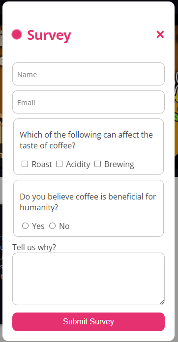

# Simple Coffee Enthusiast Website V2.

### Technology Used:

                

## Brief Description

This website is made for RevoU assignment. 
The purpose for this assignment is to implement responsive design about anything that I like. Since I love coffee and always drink it everyday, then I decided to make the website about coffee. This simple website is an improvement from last week assignment, [click here to visit the previous website](https://steffan-revou-week2.netlify.app/).

### Added features:

1. Custom font
2. Text-shadow
3. Single responsive bg-image
4. Asymmetrical grid
5. Date form element
6. Carousel hero-banner
7. Dark & light mode
8. CSS animation

## This is the website link:

Click here: [Coffee Website V2](https://steffan-revou-week3.netlify.app/)

### Dark & Light Mode

<table>
  <tr>
    <td align="center" style="vertical-align: top;">
      
    </td>
    <td align="center">
      
    </td>
  </tr>
</table>

### Survey and Register Button Modal:

<table>
  <tr>
    <td align="center" style="vertical-align: top;">
      
    </td>
    <td align="center">
      
    </td>
  </tr>
</table>

### Lighthouse Result

  

  

### Mobile View

  

