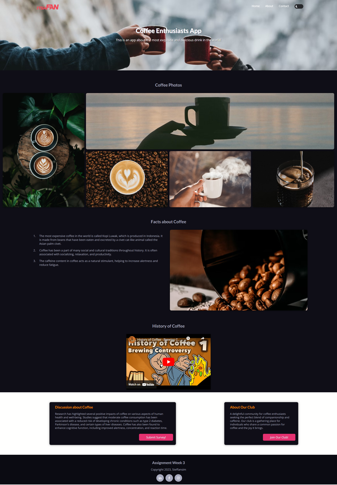
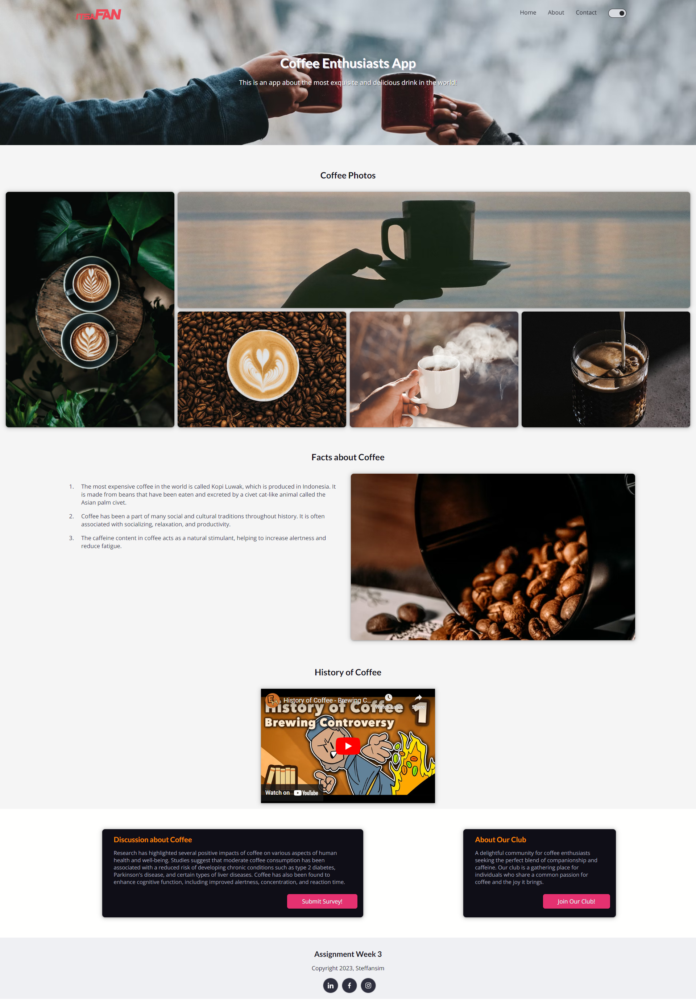
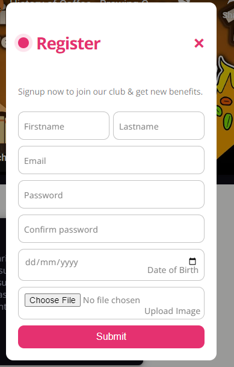
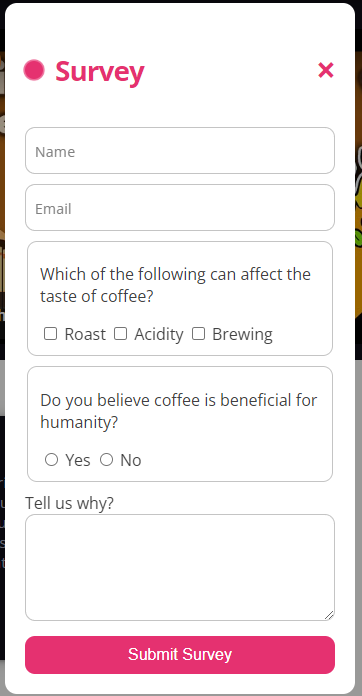
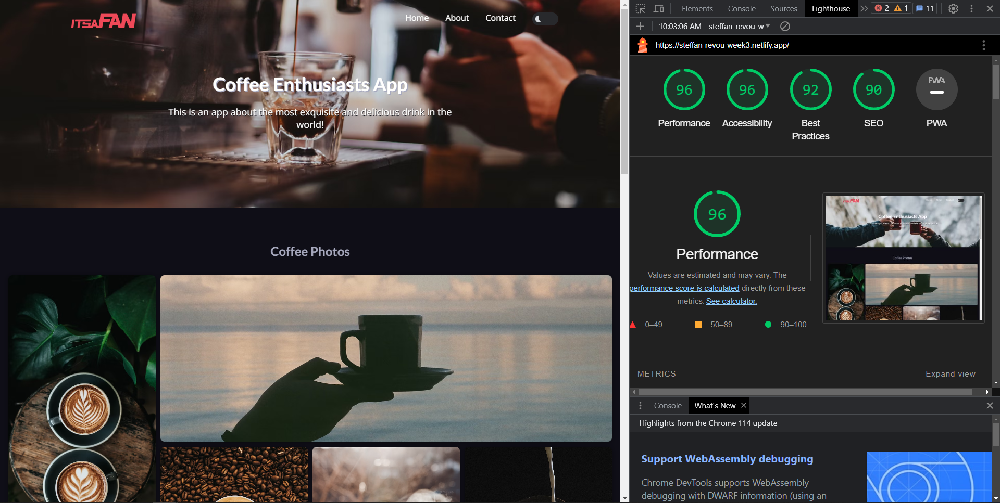
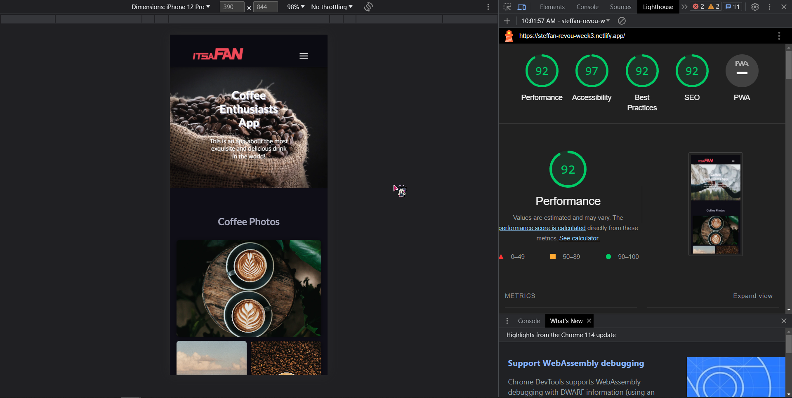
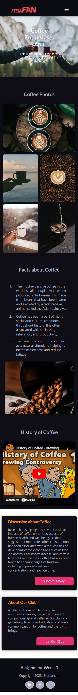

# Simple Coffee Enthusiast Website V2.
### Technology Used:

                

## Brief Description
This website is made for RevoU assignment. 
The purpose of this assignment is to learn to deploy the website made on previous week with custom domain. 
Below is the deployment process, 
### Deployment steps:
1. Register / login to Netlify using Github.
2. On Netlify, Deploy the website from github repository.
3. Register and then buy a domain name on Niagahoster.
4. Register and set up a site on Cloudflare using domain that has been bought on Niagahoster.
5. Change the nameserver on Niagahoster based on Cloudflare nameserver.
6. Wait for the Cloudflare to configure the nameservers, usually take around 1 - 24hours.
7. Add primary domain on Netlify. 

**if you want to view the full documentation of the deployment process, click on this** [Link Here!](https://docs.google.com/document/d/1qMwkD-XZhZDRf_GG5Ubc-sOdkKRPWbh5UPLIhT8cH_Q/edit?usp=sharing)

## Website Link
Click here: [Coffee Website V2](https://steffan-revou-week4.netlify.app/)

## Website Preview
### Dark & Light Mode

<table>
  <tr>
    <td align="center" style="vertical-align: top;">
      
    </td>
    <td align="center">
      
    </td>
  </tr>
</table>

### Survey and Register Button Modal:

<table>
  <tr>
    <td align="center" style="vertical-align: top;">
      
    </td>
    <td align="center">
      
    </td>
  </tr>
</table>

### Lighthouse Result

  

  

### Mobile View

  

