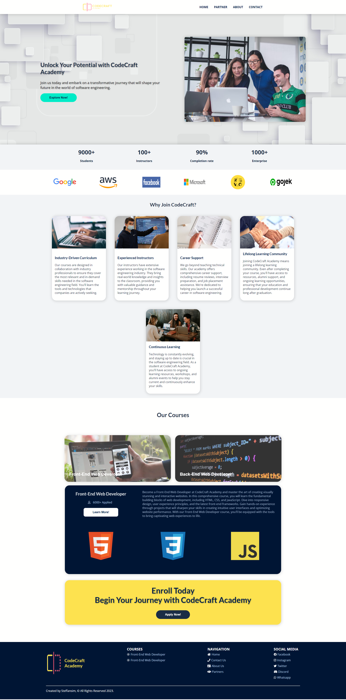

# CodeCraft Academy Website

### Technology Used:

                

## Brief Description

This website is made for RevoU assignment. 
The purpose of this assignment is to create a company profile using HTML and CSS with responsive design across different screen devices.  

#### Website Purpose:

CodeCraft Academy is a website dedicated to providing comprehensive and industry-driven software engineering courses. Our purpose is to empower individuals with the skills and knowledge needed to excel in the fast-paced world of technology.

#### Target Audiance:

Our courses are tailored to cater to both beginners and experienced professionals. Whether you are a complete novice with no coding experience or a seasoned developer looking to enhance your skills, our courses provide valuable resources and mentorship to help you achieve your goals. Our target audience includes:

- Individuals looking to start a career in software engineering
- Students seeking to supplement their formal education with practical coding skills
- Professionals who want to transition into the software engineering field
- Developers who wish to expand their knowledge and stay up-to-date with the latest technologies

#### Key Features:

- Industry-driven curriculum: Our courses are designed in collaboration with industry professionals to ensure they cover the most relevant and in-demand skills.
- Experienced instructors: Our knowledgeable instructors bring real-world experience and provide valuable guidance throughout the learning journey.
- Hands-on projects: We emphasize practical, hands-on projects that allow students to apply the concepts learned and build a robust portfolio.
- Career support: We offer comprehensive career support, including resume reviews, interview preparation, and job placement assistance.
- Flexible learning options: We provide part-time and full-time courses, as well as in-person and online formats, to accommodate diverse schedules and learning preferences.

### Website Deployment steps:

1. Register / login to Netlify using Github.
2. On Netlify, Deploy the website from github repository.
3. Register and then buy a domain name on Niagahoster.
4. Register and set up a site on Cloudflare using domain that has been bought on Niagahoster.
5. Change the nameserver on Niagahoster based on Cloudflare nameserver.
6. Wait for the Cloudflare to configure the nameservers, usually take around 1 - 24hours.
7. Add primary domain on Netlify. 

**if you want to view the full documentation of the deployment process, click on this** [Link Here!](https://docs.google.com/document/d/1qMwkD-XZhZDRf_GG5Ubc-sOdkKRPWbh5UPLIhT8cH_Q/edit?usp=sharing)

## Website Link

Click here: [CodeCraft Academy Website](https://steff-coffee.site/)

#### Website Structure:

- Header
  - Logo
  - Navbar
- Main
  - Hero Banner
  - Counter Statistics
  - Partners
  - Offers
  - Courses
  - CTA
- Footer

## Website Preview

### Responsive View Screenshot

<table>
  <tr>
    <td align="center" style="vertical-align: top;">
      
    </td>
  </tr>
  <tr>
    <td align="center" style="vertical-align: top;">
      
    </td>
  </tr>
  <tr>
    <td align="center" style="vertical-align: top;">
      
    </td>
  </tr>
</table>

