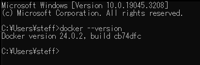
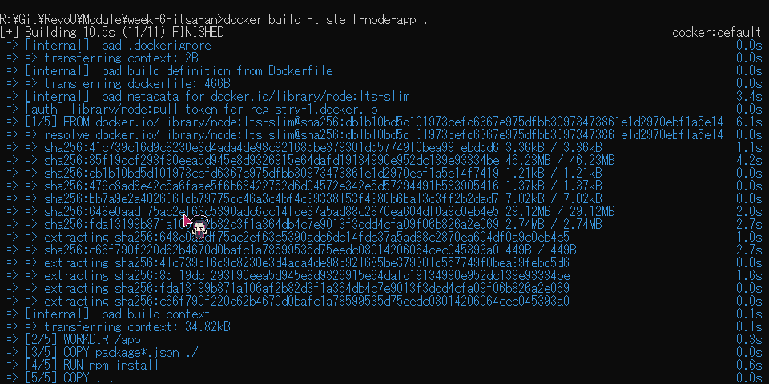
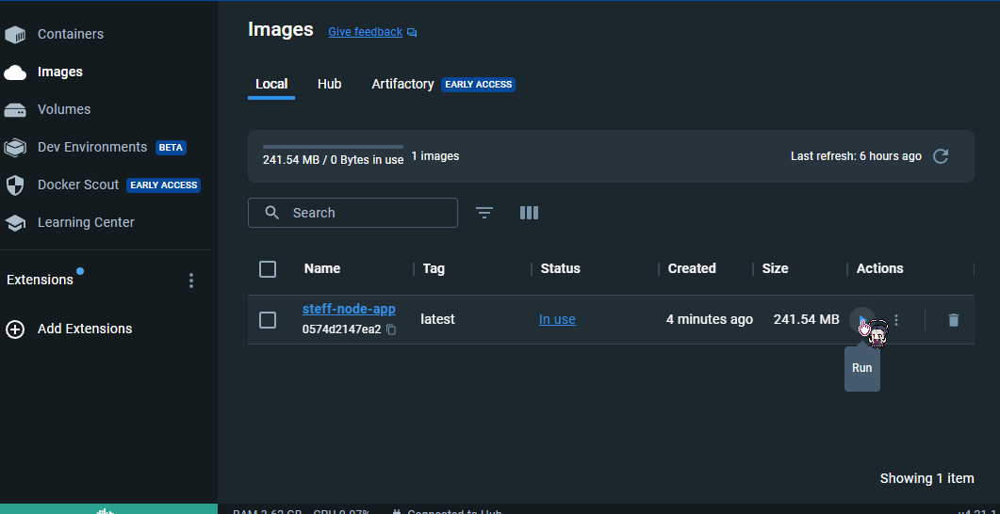
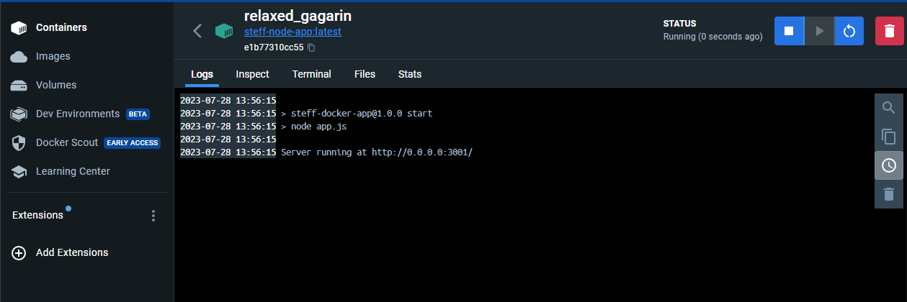
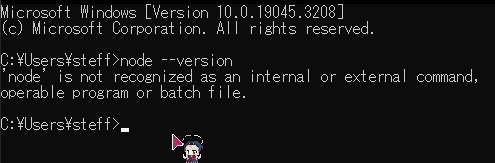

# Docker Assignment

## Brief Description
Docker is a widely used platform and tool that enables developers to create, deploy, and run applications in a containerized environment. Docker is an open-source containerization platform that allows developers to package applications and their dependencies into isolated containers. Containers are lightweight, portable, and self-sufficient units that include everything needed to run an application, such as the code, runtime, system libraries, and settings. 

#### Assignment Purpose:
To understand Docker concepts and able to containerize a Node.js application effectively.

### Getting Started :
#### Install Docker
1. Visit [Docker Website](https://www.docker.com/)
2. Download the installer based on your machine operating system.
3. After installing, possibly you are required to install WSL
   * If yes, you can go to command prompt or your machine terminal run: `wsl.exe --install` `or wsl.exe --update`
4. You can register and login your docker account.
5. Final step is to make sure your docker version or docker is properly installed on machine by checking it on command prompt or terminal `docker --version`



#### Start with simple node application.
1. Create an empty folder for the project
2. Create `app.js` file and run your own code editor
3. Write simple code, on this assignment the code below is provided by the instructor:
```javascript
const http = require('http');

const hostname = '0.0.0.0';
const port = 3001;

const server = http.createServer((req, res) => {
  res.statusCode = 200;
  res.setHeader('Content-Type', 'text/plain');
  res.end('Hello World');
});

server.listen(port, hostname, () => {
  console.log(`Server running at http://${hostname}:${port}/`);
});
```
4. Create `package.json` file on the same working directory
5. Write the configuration and dependencies for our node js application. You can follow this simple package below:

```json
{
  "name": "steff-docker-app",
  "version": "1.0.0",
  "description": "Assignment NodeJS on Docker",
  "author": "Steffansim",
  "main": "app.js",
  "scripts": {
    "start": "node app.js"
  },
  "dependencies": {}
}
```
#### Next, we dockerize our small project
1. Create file named `Dockerfile`
2. Write the line like this, you can visit this [Link](https://docs.docker.com/language/nodejs/build-images/) to read the full documentation.
```Dockerfile
# Choosing node latest for this app
FROM node:lts-slim

# Create and set a working directory for the project
WORKDIR /app

# Copying the package.json to the docker container
COPY package*.json ./

# Install Node dependencies
RUN npm install

# Copying the rest of the application files to the container
COPY . .

# Exposing the port for this app
EXPOSE 3001

# Executing and start app.js
CMD ["npm", "start"]
```
3. Next step, open command prompt or terminal on the same project directory.
4. On terminal, to build the Docker image run this command: `docker build -t my-node-app .`
   <Br> _note: my-node-app is the image name, so you can customize it_
   * Example successfully build: 
5. Open your docker application and go to images, you will see there newly added image.
  * Example: 
6. Click Run to start the application.
  * If successful, you will see the screen like this: 
   

### Important notes:
 It's perfectly fine not to have Node.js installed on your local machine when using Docker to run a Node.js application. Docker allows you to package your application and its dependencies into a container, which can then be executed in an isolated environment. This means you don't need to have Node.js or any other dependencies installed directly on your local machine.
 _On my case here, I dont have node installed and I can still run it like the example above_<br>
   


[](https://classroom.github.com/a/nj7iw4Wb)
