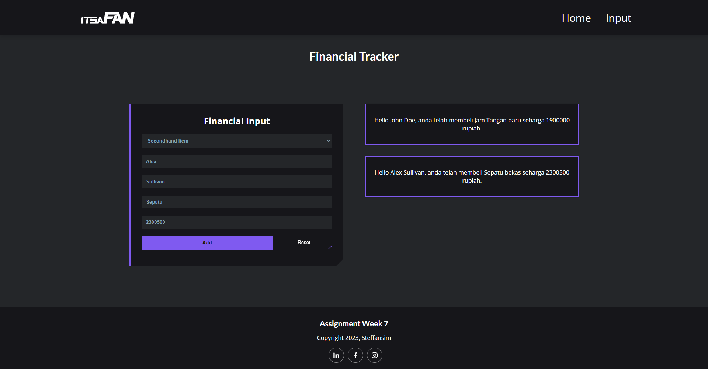
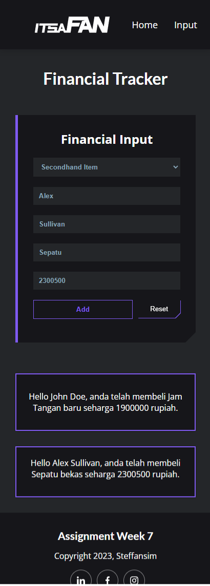

# Simple Financial Tracker App

### Technology Used:

       

                

## Brief Description
This website is made for RevoU assignment. 
The purpose of this assignment is to create an interactive website app in which the user can input their asset or buyout and track them. The functionality of this website is build using Typescript DOM.

### Getting Started :
#### Build a Starting App
1. Initialize Node.js on project directory by using `npm init -y`
2. Installing TypeScript by using `npm install typescript`
3. After installing TypeScript, configure it by using `npx tsc --init`, this will give you a file named `tsconfig.json`.
4. (Optional) You can add your own NPM packages for example like bootstrap, by visiting this [website](https://www.npmjs.com/) to search the packages that you need 

#### Write the code
1. Create a `index.html` file, and write a form about financial input.
2. Create `index.ts` file, and write TS code to handle DOM.
3. After finishing our TS code, we need to compile the TypeScript to JavaScript by running `npx tsc`

#### Deployment
1. Register / login to Netlify using Github.
2. On Netlify Dashboard, click on `add new site`
3. Then proceed to deploy the website from github repository.

## Website Link

Click here: [Fashion Buyout Tracker Website](https://steff-revou-week7.netlify.app/)

## Website Preview

