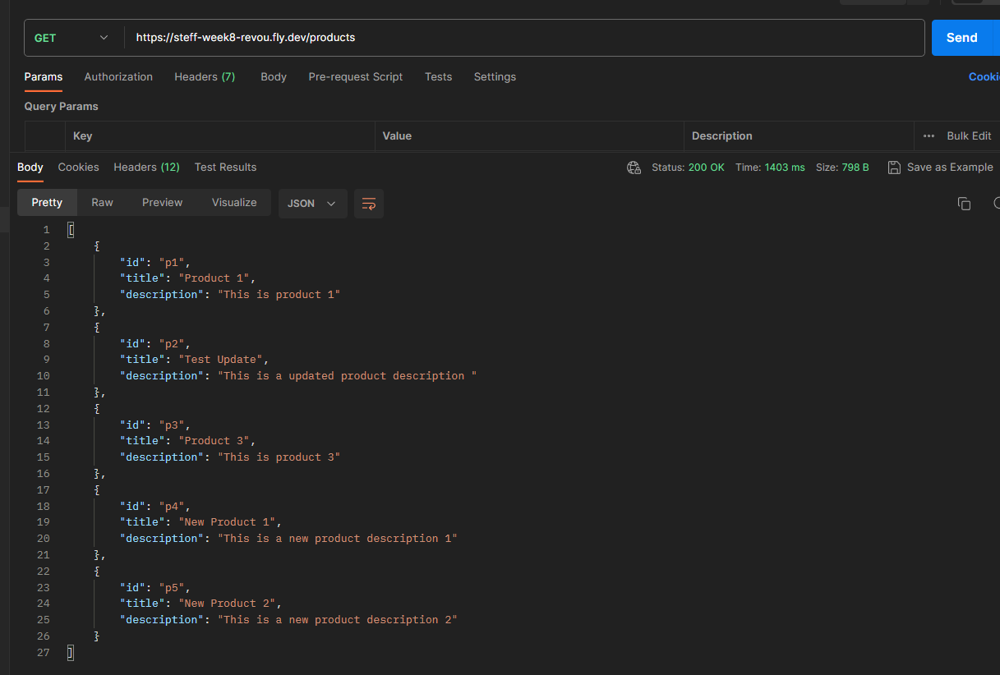

# Simple REST API Server about Products with Login Authentication and Authorization

### Technology Used:

<p align="left">
       


</p>

## Brief Description

Express.js, commonly referred to as Express, is a minimal and flexible web application framework for Node.js, a runtime environment that allows developers to execute JavaScript code server-side. Express.js provides a set of tools and features that make it easier to build web applications and APIs.

#### Assignment Purpose:

This project is made for RevoU assignment.<br>
The purpose of this assignment is to implement HTTP method request handlers using Node Js, TypeScript, & Express JS that allows users to perform basic CRUD on a e-commerce product.


#### Guide to use this app

1. Git clone this repository.
2. Open the project and start with `npm install`, this will install all dependencies.
3. Run `npm run build`, to compile TS into JS.
4. Create your own .env file (this will contain sensitive data or variables for your project.)
   - For this project, you can change the port number and secret key as you like:

```env
PORT=4000
JWT_SECRET=verysecretkey
```

5. Run `npm start` to start the project, you will get a notification like this `Server listening on port 4000`
6. Now you have successfully run the project.

#### Important!

You will also need API tools to help you ensure that the function you created is working properly, in my case I use `Postman`, <br>
you can install it [here](https://www.postman.com/), You will also need postman to access the endpoint for this back-end project, since it have JWT authentication & authorization to access a certain or specific endpoint.

### This project is deployed using fly.io

#### User Data & Product Dummy Data

```json
[
  { "username": "user", "password": "pass123", "role": "user" },
  { "username": "admin", "password": "pass123", "role": "admin" },
];
```

```json
    "products": [
      { "id": "p1", "title": "Product 1", "description": "This is product 1" },
      { "id": "p2", "title": "Product 2", "description": "This is product 2" },
      { "id": "p3", "title": "Product 3", "description": "This is product 3" }
    ]
```

#### Routes or API-endpoint for this deployed project:

- https://steff-week8-revou.fly.dev/products - To View All Products
- https://steff-week8-revou.fly.dev/products/p2 - To View Product by Id (only authenticated user/admin can see)
- https://steff-week8-revou.fly.dev/products/add - To Add new product (only admin)
- https://steff-week8-revou.fly.dev/products/p2 - To edit a product (only admin)
- https://steff-week8-revou.fly.dev/products/p2 - To delete product (only admin)
- https://steff-week8-revou.fly.dev/auth - To get accessToken (login with username and password provided above)

#### Testing the Endpoint above with Postman app

1. Choose `POST` method & url, then on body - Input `username` and `password` to get the accessToken for user
   
2. Copy the user `accessToke`, then choose `GET` method & input url to view product by id. Choose Authorization - type `BearerToken` and copy the accessToken from before.
   
3. Try `POST` new product using user `accessToken`, you will get access denied like the screenshot below.
   
4. Repeat no 1 but input `username` and `password` for admin, copy the `accessToken` and paste it on Authorization - BearerToken.
5. Choose `POST` method again , and you will be able to post the data
   
6. Next, after posting the product, try viewing all products again to see the result.
7. To update the product data, choose `PUT` method and input the url and write like this for example:

```json
{
  "id": "p2",
  "title": "Test Update",
  "description": "This is a updated product description "
}
```

Result shown:
 8. To delete the data, choose `DELETE` method, and input the url , the endpoint `p1, p2, p3` is up to you, it is based on the product id.
_Example use p2 to delete product 2_

Check if product 2 is deleted


[](https://classroom.github.com/a/sRKW9Tsr)
